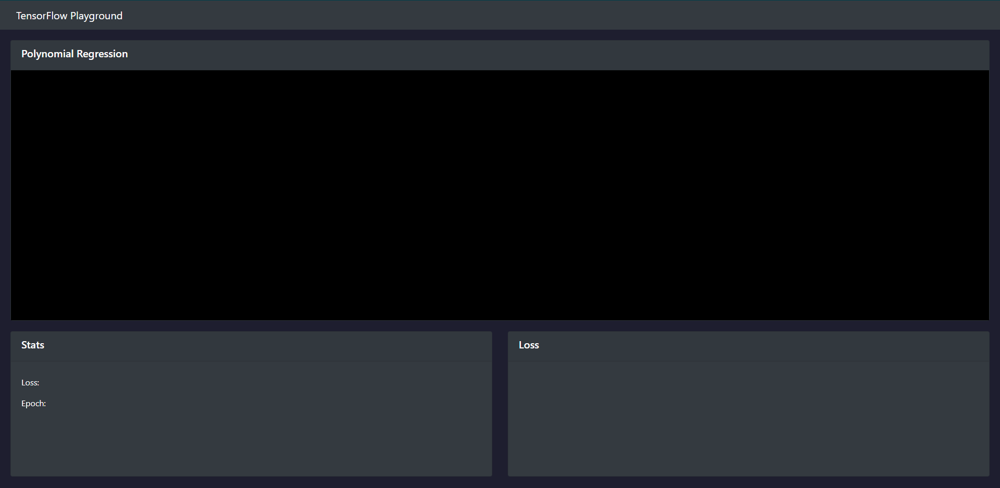
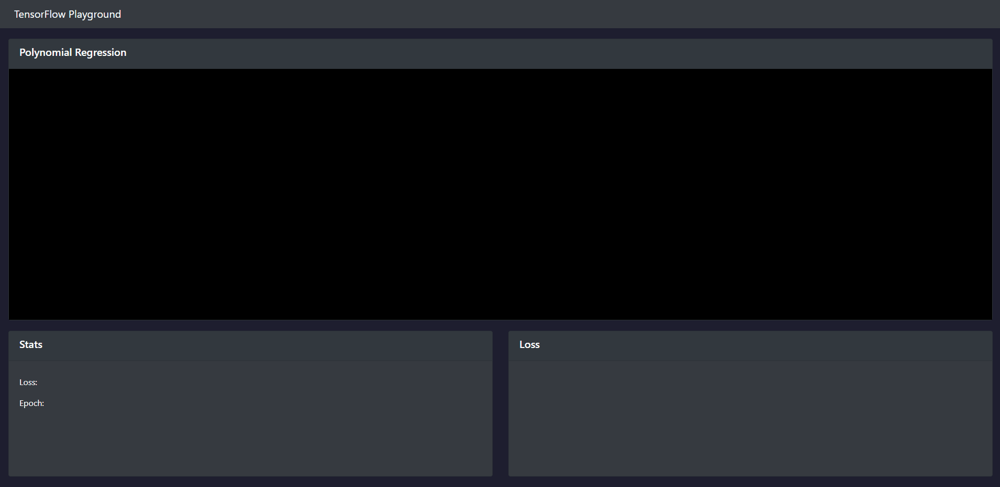
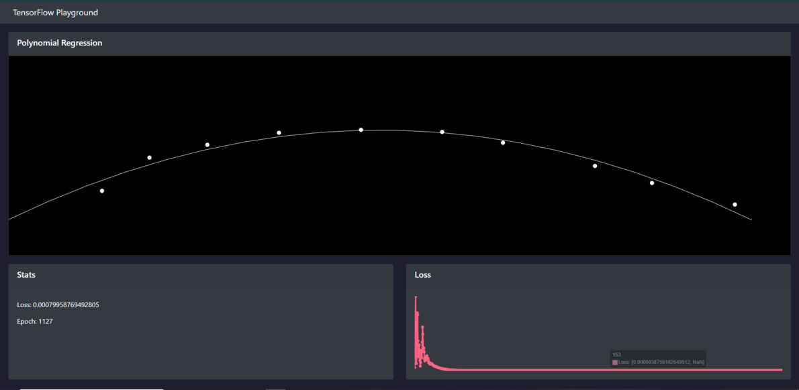

# TensorFlow Playground

This is an interactive environment where you can visualise a non-linear regression model best fit the data points that the user provides.

You can try this out here: https://joewadsworth.github.io/TensorFlow-Playground/

## Demo
On start, the page will look like below.

You can interact by adding points to the black canvas. The model will learn and reduce the loss to best match the data points you provide.

Over time, the model will become more accurate, which can be confirmed by the loss graph.

*A Project by Joe Wadsworth*